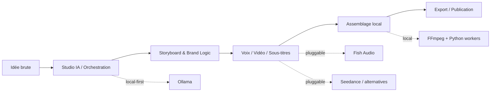

<div align="center">

# 🎬 FILM-CREW

### The AI-native control tower for short-form video production

Turn a raw idea into a branded short-form content pipeline — with local-first orchestration, modular AI providers, and a creator workflow built to scale.

[](#current-status)
[](./LICENSE)
[](https://nextjs.org/)
[](https://react.dev/)
[](https://www.typescriptlang.org/)
[](https://www.postgresql.org/)
[](https://www.linkedin.com/in/malik-karaoui/)

</div>

---

## Pourquoi ce projet peut faire très mal 🚀

Le marché de la vidéo courte IA est encore un puzzle : idéation, script, voix, vidéo, sous-titres, publication… tout est éclaté entre plusieurs outils.

**FILM-CREW** vise à devenir l'orchestre complet :

- **une interface unique** pour piloter la production vidéo courte
- **une architecture modulaire** pour brancher plusieurs providers IA sans refacto du core
- **une logique brand-aware** pour garder une identité cohérente par chaîne
- **un mode local-first** pour garder le contrôle des coûts, des prompts et du workflow

En clair : moins de SaaS spaghetti, plus de contrôle, plus de cadence, plus de cohérence.

## Ce que le repo fait aujourd'hui

Le projet est en **phase Alpha**, mais on n'est plus sur un simple squelette UI : le coeur produit commence à vraiment respirer.

### Déjà en place

- **CRUD des chaînes** avec base Brand Kit
- **base PostgreSQL + Drizzle ORM** prête pour les runs, étapes, clips et traces agents
- **interface Next.js structurée** avec navigation, sidebar, topbar et pages dédiées
- **pipeline canonique 9 étapes** pour passer d'une idée brute à un export publiable
- **studio d'agents** avec réunion orchestrée, traces, progression et lecture des prises de parole
- **storyboard rough local réel** : une vignette PNG par scène + une planche composée localement
- **blueprint visuel dédié** entre le JSON structuré et le storyboard pour améliorer la lisibilité scène par scène
- **plan cloud Ollama en parallèle** du rough local pour enrichir automatiquement le dessin sans mentir sur le rendu final
- **premières briques virales YouTube** : parsing de segments, grounding transcript, création de runs viraux et export shorts 9:16
- **observabilité providers / failover / coût** dans l'UI
- **setup local** Node + Python + FFmpeg + PostgreSQL

### En construction

- durcissement runtime end-to-end avec vrais providers sur tous les chemins critiques
- couverture produit complète sur génération vidéo / TTS / publication sociale
- packaging plus propre des workflows viraux et shorts
- gestion avancée des quotas, retries et résilience multi-providers

## Pipeline alpha actuel

Le tunnel principal est désormais explicite et partagé partout dans l'app :

1. **Idée**
2. **Brainstorm**
3. **JSON structuré**
4. **Blueprint visuel**
5. **Storyboard**
6. **Prompts Seedance**
7. **Génération**
8. **Preview**
9. **Publication**

Le point important : l'étape 4 n'est pas un gadget. Elle produit un `storyboard-blueprint.json` qui sert de pivot entre le JSON narratif, le rough local et l'enrichissement cloud.

## La vision produit

L'objectif est simple : construire un **studio de production IA pour créateurs solo**, capable de transformer une idée brute en pipeline éditorial industrialisé.

À terme, FILM-CREW doit permettre de :

- structurer une idée via un **studio virtuel d'agents IA**
- produire un storyboard cohérent avec le **Brand Identity Kit** et un **blueprint visuel scène par scène**
- orchestrer la voix, la vidéo et l'assemblage final
- localiser le contenu en plusieurs langues
- exporter, publier et scaler sans multiplier les outils

## Stack technique

| Couche | Stack |
| --- | --- |
| Frontend | Next.js 16, React 19, TypeScript 5, Tailwind CSS 4 |
| UI | shadcn, Base UI, Lucide React |
| State | Zustand |
| Backend app | App Router + API Routes |
| Database | PostgreSQL 17 + Drizzle ORM |
| Workers locaux | Python 3.12+ |
| Média & tooling | FFmpeg |
| Providers visés | Ollama, Fish Audio, Seedance, providers vidéo/TTS interchangeables |

## Architecture, en un regard



## Ce qui rend FILM-CREW différent

### 1. Local-first, pas local-only

L'idée n'est pas de tout faire en local à tout prix.
L'idée est de **garder le cerveau, l'orchestration et la logique métier sous contrôle**, puis d'utiliser les meilleurs providers au bon endroit.

### 2. Architecture pluggable

Le repo est pensé pour que les briques changent vite :

- un nouveau modèle vidéo sort ? il s'intègre derrière la même interface
- un provider TTS tombe ? on bascule
- un LLM local devient meilleur ? on le branche

### 3. Brand identity comme primitive produit

Ici, une chaîne n'est pas juste un nom.
C'est un **pack d'identité** : style, voix, palette, références visuelles, tonalité.

### 4. Vision produit orientée créateur opérateur

Ce projet n'est pas un gadget de démo.
Il est pensé comme une **machine de production** pour quelqu'un qui veut publier souvent, bien, et avec une logique système.

## Quick start

### Prérequis

- Node.js **20+**
- Python **3.12+**
- FFmpeg
- PostgreSQL **17**

### Installation express

```bash
cp .env.example .env.local
npm install
npx drizzle-kit push        # initialise le schéma DB
npm run dev
```

L'application sera disponible sur `http://localhost:3000`.

### Vérification rapide

```bash
npm run typecheck
npm test
```

## Variables d'environnement

Le repo fournit un fichier `.env.example` plus riche que le strict minimum. Voilà les variables les plus importantes pour démarrer ; pour TikTok / YouTube / TTS local, regarde directement le fichier.

| Variable | Description |
| --- | --- |
| `DATABASE_URL` | connexion PostgreSQL locale |
| `SEEDANCE_API_KEY` | clé API provider vidéo |
| `FISH_AUDIO_API_KEY` | clé API voice / TTS |
| `OLLAMA_URL` | endpoint local Ollama |
| `OLLAMA_MODEL` | modèle local par défaut pour les appels LLM |
| `OLLAMA_STORYBOARD_CLOUD_ENABLED` | active le plan storyboard cloud parallèle |
| `OLLAMA_STORYBOARD_CLOUD_MODEL` | modèle cloud visé pour enrichir le storyboard |
| `OLLAMA_CLOUD_URL` | endpoint cloud Ollama direct |
| `OLLAMA_API_KEY` | clé API Ollama cloud si accès direct |
| `PEXELS_API_KEY` | source média stock optionnelle |
| `PIXABAY_API_KEY` | source média stock optionnelle |
| `TTS_PRIORITY` | ordre de résolution des providers TTS |
| `KOKORO_URL` | endpoint Kokoro local |
| `PIPER_BINARY` | chemin du binaire Piper local |

## Ce qu'il faut savoir sur le storyboard

- le **rough final de storyboard reste local** ; il est dessiné via `storyboard-local`
- le **cloud Ollama ne ment pas sur la marchandise** : il génère un **plan JSON** plus intelligent, puis ce plan est réinjecté dans le renderer local
- les artefacts clés sont stockés dans `storage/runs/<runId>/` avec notamment :
	- `structure.json`
	- `storyboard-blueprint.json`
	- `storyboard/manifest.json`
	- `prompt-manifest.json`
	- `preview-manifest.json`
	- `publish-manifest.json`

## Structure du repo

```text
src/
├── app/           # pages Next.js
├── components/    # UI components
├── lib/           # logique partagée
├── store/         # state management
└── types/         # types TypeScript

scripts/           # scripts utilitaires
storage/           # artefacts locaux
templates/         # templates futurs du pipeline
```

## Current status

Le bon wording ici, c'est : **ambitieux, déjà vivant, encore en durcissement**.

Si tu explores le repo aujourd'hui, tu verras surtout :

- un **pipeline 9 étapes déjà branché dans l'app**
- un **storyboard rough honnête et local-first**
- une **surcouche cloud parallèle** pour enrichir le storyboard sans casser le mode local
- un **studio d'agents** plus lisible côté réunion / traces
- des **fondations virales YouTube** déjà exploitables

Le gros sujet restant, c'est le **runtime réel provider par provider** sur tous les chemins, avec le même niveau d'honnêteté que sur le storyboard.

## Roadmap produit

- [x] fondations Next.js + Drizzle + PostgreSQL
- [x] gestion des chaînes / structure Brand Kit
- [x] architecture UI de pilotage
- [x] pipeline alpha 9 étapes
- [x] storyboard rough local + blueprint visuel
- [x] monitoring providers, failover et coût en surface UI
- [x] extraction virale YouTube (base produit + parsing)
- [x] export shorts 9:16 avec sous-titres burnés en alpha
- [ ] validation runtime complète de tous les providers critiques
- [ ] génération vidéo / audio / sous-titres durcie en production
- [ ] publication multi-plateforme

## Pourquoi suivre ce repo

Parce qu'il attaque un vrai sujet :

> **comment transformer la création vidéo IA en système opérable, cohérent et scalable ?**

Pas juste “faire une vidéo”.
Construire le cockpit qui permet d'en produire **beaucoup**, avec une identité forte, des coûts maîtrisés et une architecture qui survit au prochain raz-de-marée IA.

## Licence

Distribué sous licence **MIT**. Voir [`LICENSE`](./LICENSE).

## Auteur

**Malik Karaoui**


---

<div align="center">
	<sub>Built for creators who want leverage, not tool fatigue.</sub>
</div>

<!-- TODO: Remplacer le lien LinkedIn du badge par l'URL réelle du profil. -->
